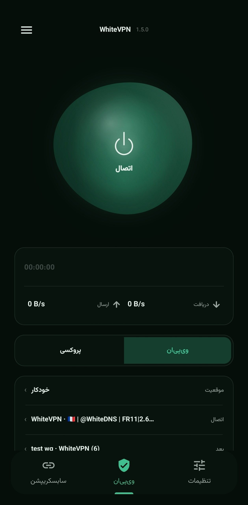

# WhiteVPN for Android

[](https://github.com/WhiteDNS/WhiteVPN/releases/latest)
[](LICENSE)

A simple, open-source Android VPN client powered by [Mihomo](https://github.com/MetaCubeX/mihomo). WhiteVPN works out of the box with a built-in WhiteDNS subscription and also lets you bring your own.

<p align="center">
  
</p>

## Features

- One-tap **VPN** mode and local **proxy** mode
- Built-in WhiteDNS subscription, custom subscriptions, automatic refresh and offline cache
- Manual server selection plus latency and download-speed tests
- Subscription, Iran-bypass and global-proxy routing modes
- Split tunnelling: bypass selected apps or proxy only selected apps
- Automatic DNS, DNS over HTTPS (DoH) and DNS over TLS (DoT)
- Clean-IP scanning, optional ByeDPI compatibility and authenticated LAN sharing
- Persian and English interfaces with system, light and dark themes

## Supported methods and inputs

Share links:

- VLESS
- VMess
- Trojan
- Shadowsocks (`ss://`)
- Hysteria 2 (`hysteria2://` and `hy2://`)
- WireGuard, including supported AmneziaWG options

Subscriptions can be added as an HTTPS URL or pasted directly. WhiteVPN accepts plain or Base64-encoded link lists, Mihomo YAML, Clash JSON, and Xray JSON arrays. Clash JSON supports VLESS, VMess, Trojan, Shadowsocks and WireGuard entries; Xray JSON supports VLESS, VMess, Trojan and WireGuard outbounds.

## Built-in subscription

No subscription is required for first use. The default build uses the public [WhiteDNS Mihomo subscription](https://github.com/iampedii/whitedns-sub/blob/main/mihomo.yaml), refreshes it every 30 minutes while connected, and keeps the last valid copy for temporary network failures.

Distributors can replace the source at build time with `WHITEDNS_MIHOMO_SUBSCRIPTION_URL`. Custom subscriptions remain separate and can be tested, selected, refreshed, edited or removed in the app.

## Community

- Telegram channel: [@whitedns](https://t.me/whitedns)
- Telegram group: [@whitedns_group](https://t.me/whitedns_group)

## Install

Download the latest APK from [GitHub Releases](https://github.com/WhiteDNS/WhiteVPN/releases/latest). WhiteVPN requires Android 8.0 (API 26) or newer.

## Build

Requirements: JDK 17, Go, Android SDK and Android NDK.

```bash
./scripts/build-flclash-core.sh
./gradlew testDebugUnitTest assembleDebug
```

The build script checks out the pinned [FlClash](https://github.com/chen08209/FlClash) integration, builds Mihomo v1.19.30 for all supported Android ABIs, and generates the JNI files consumed by the app.

## Third-party software

- [Mihomo](https://github.com/MetaCubeX/mihomo) — proxy core
- [FlClash](https://github.com/chen08209/FlClash) — Android core/JNI integration
- [SubConv](https://github.com/SubConv/SubConv) — adapted share-link conversion logic
- [ByeDPI](https://github.com/hufrea/byedpi) — optional DPI-bypass compatibility
- AndroidX, Material Components, Kotlin Coroutines and Firebase Analytics

Their respective licenses and notices continue to apply.

## Contributing

Issues and pull requests are welcome. Keep changes focused, avoid committing subscriptions or secrets, and run the local checks before opening a PR:

```bash
./gradlew testDebugUnitTest assembleDebug
git diff --check
```

Please describe what changed, why it is needed, and what you tested.

## License

WhiteVPN is licensed under [GPL-3.0-only](LICENSE).
